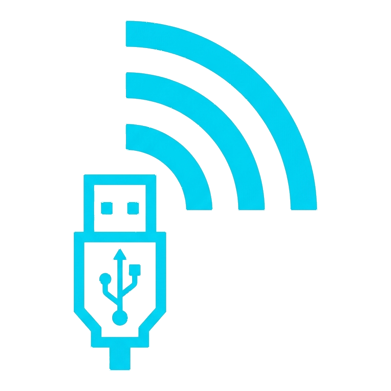

# [ESP32 WiFi Virtual Human Interface Device](https://leecheeyong.github.io/esp32-wifi-virtual-hid)
Turn your ESP32-S2 or ESP32-S3 into a driverless, plug-and-play USB keyboard & mouse. Control any target device remotely over a standalone Wi-Fi Access Point. 

## Tested Devices
| Device | Support | Note |
| ------ | ------- | ---- |
| **ESP32-S2 Mini** | ✅ | Works well |
| **ESP32-S3 N16R8** | ✅ | Exceptionally well |

## Features
- **Native USB HID:** Acts as a standard plug-and-play USB mouse and keyboard. No client software required on the host computer.
- **Standalone Network:** Creates its own Wi-Fi network (Access Point), meaning it works anywhere without needing an existing router.
- **On-Screen Trackpad:** Smooth and optimized deadzone filtering to prevent cursor drift, network flooding, and jitter.
- **Web UI:** A minimalist interface that scales perfectly across portrait and landscape orientations on mobile/tablets.

## Setup and Installation

### Option 1: ESP Web Tools (Recommended)
1. Open the **[Web Flasher](https://leecheeyong.github.io/esp32-wifi-virtual-hid/flasher)** (or `docs/flasher.html`) in Google Chrome or Microsoft Edge.
2. Hold down the **BOOT** button on your ESP32 board and plug in the USB cable.
3. Click **Connect Device**, choose your COM port, and install.
4. Press **RESET** (or unplug/replug USB) to start the board.

### Option 2: esptool.py (Command Line Flashing)
For **ESP32-S2 Mini**, flash the 3 binaries at their respective offsets:
```bash
esptool.py -p <COM_PORT> -b 460800 --chip esp32s2 write_flash \
  0x1000 docs/firmware/{version}/esp32-s2-mini-virtual-hid-{version}.bootloader.bin \
  0x8000 docs/firmware/{version}/esp32-s2-mini-virtual-hid-{version}.partitions.bin \
  0x10000 docs/firmware/{version}/esp32-s2-mini-virtual-hid-{version}.firmware.bin
```

### Option 3: Arduino IDE (From Source)
1. **Configure Arduino IDE:**
    - Board: Select your ESP32-S2 or ESP32-S3 board model.
    - USB CDC On Boot: Enabled
    - USB Mode: Hardware CDC and JTAG (or Native USB)
2. **Upload:**
    - Connect the board, select the COM port, and upload [sketch.ino](sketch.ino) & [html.h](html.h)

## Usage
1. Plug the ESP32 into the computer you want to control.
2. Connect to the Wi-Fi network named `ESP32 Virtual Hid` (Default password: `password123`)
> [!NOTE]
> You may change the ssid and the Wi-Fi password in `sketch.ino` 
4. Open a web browser and navigate to: [http://192.168.4.1](http://192.168.4.1)
5. Swipe the trackpad area to move the mouse, tap to click, and use the input field to type text.

## License
This project is available as an open source under the terms of the [MIT License](/LICENSE).
